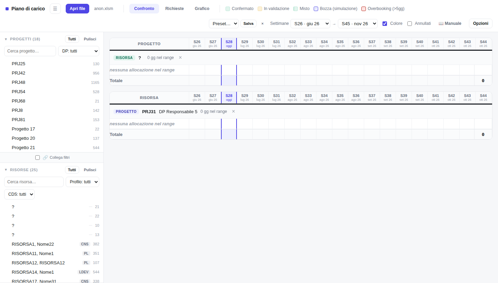
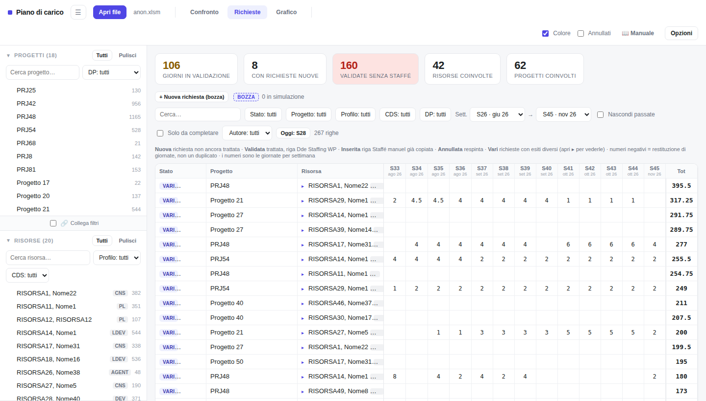
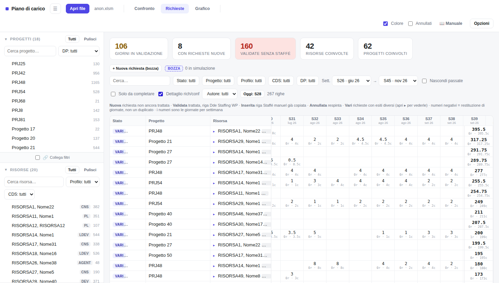
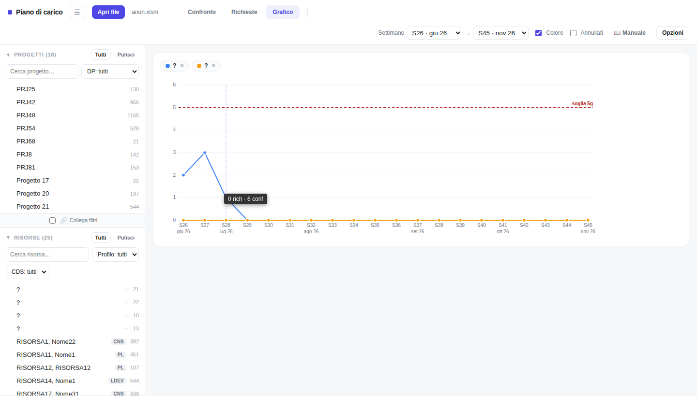

# Piano di carico

App per la gestione dello staffing su file Excel (Plan de charge / FusionData). Nessuna installazione, nessun server: si apre un file HTML nel browser.

## Cosa fa

- **Confronto**: occupazione di risorse e progetti settimana per settimana, a partire dai dati FusionData.
- **Richieste**: elenco richieste di staffing (nuove, validate, inserite), con composer per creare bozze e confermare richieste.
- **Grafico**: andamento del carico nel tempo per le risorse selezionate.

## Screenshot

**Confronto** — occupazione risorse/progetti per settimana

**Richieste** — elenco e stato delle richieste di staffing

**Richieste, dettaglio rich/conf** — giorni richiesti vs già confermati per settimana

**Grafico** — andamento carico nel tempo

## Installazione

1. Scarica l'ultima versione: [piano-carico.zip](https://github.com/themask1987/piano-carico/raw/main/piano-carico.zip)
2. Estrai lo zip (richiede una password, fornita separatamente dal team)
3. Apri `index.html` in Chrome o Edge

## Requisiti

- Chrome o Edge (per la condivisione `.bak` tra colleghi serve la File System Access API)
- Un file `.xlsm`/`.xlsx` compatibile con la struttura Plan de charge / FusionData

## Aggiornamenti

L'app controlla automaticamente all'avvio se è disponibile una versione più recente e mostra un banner con link diretto al download.
